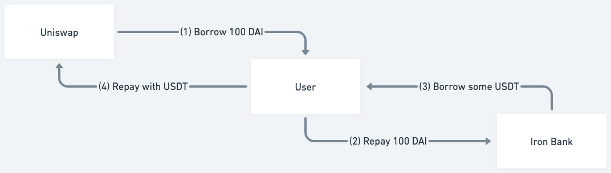
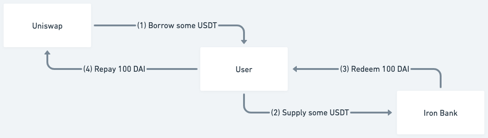

# Iron Bank Extension

IBv2 currently offers two official extensions: TxBuilderExtension and UniswapExtension.

### TxBuilderExtension

TxBuilderExtension allows users to perform multiple operations in a single transaction. For example, if a user wishes to supply WETH and borrow USDT, USDC, and DAI, they can achieve this with a single click using TxBuilderExtension. With the defer liquidity check feature, users could further save a lot of gas consumption. Additionally, TxBuilderExtension supports native ETH as well as pToken and its underlying token conversions.

### UniswapExtension

UniswapExtension enables users to better manage their positions by utilizing Uniswap's flashswap feature. Currently, the UniswapExtension offers six actions: open long position, close long position, open short position, close short position, debt swap, and collateral swap.

## Usage

Any action in TxBuilderExtension or UniswapExtension needs to have two fields, name and data. For data, it needs to use `abi.encode` to serialize the data into bytes32. The provided operations include:

## TxBuilderExtension

### Supply Native Token

Help user wrap Ether into WETH and supply it into Iron Bank.

Action name: `ACTION_SUPPLY_NATIVE_TOKEN`

Action data: None, but `msg.value` should be the supply amount.

### Borrow Native Token

Help user borrow WETH from Iron Bank and unwrap it to Ether.

Action name: `ACTION_BORROW_NATIVE_TOKEN`

Action data:
| Type | Description |
|------|-------------|
| uint256 | the borrow amount |

### Redeem Native Token

Help user redeem WETH from Iron Bank and unwrap it to Ether.

Action name: `ACTION_REDEEM_NATIVE_TOKEN`

Action data:
| Type | Description |
|------|-------------|
| uint256 | the redeem amount, -1 will redeem full |

### Repay Native Token

Help user wrap Ether into WETH and repay it into Iron Bank. If user repays more than borrow balance, the excessive amount will return to user.

Action name: `ACTION_REPAY_NATIVE_TOKEN`

Action data: None, but `msg.value` should be the repay amount.

### Supply

Help user supply asset.

Action name: `ACTION_SUPPLY`

Action data:
| Type | Description |
|------|-------------|
| address | the supply asset |
| uint256 | the supply amount |

### Borrow

Help user borrow asset.

Action name: `ACTION_BORROW`

Action data:
| Type | Description |
|------|-------------|
| address | the borrow asset |
| uint256 | the borrow amount |

### Redeem

Help user redeem asset.

Action name: `ACTION_REDEEM`

Action data:
| Type | Description |
|------|-------------|
| address | the redeem asset |
| uint256 | the redeem amount, -1 will redeem full |

### Repay

Help user repay asset.

Action name: `ACTION_REPAY`

Action data:
| Type | Description |
|------|-------------|
| address | the repay asset |
| uint256 | the repay amount, -1 will repay full |

### Supply stETH

Help user wrap stETH into wstETH and supply it into Iron Bank.

Action name: `ACTION_SUPPLY_STETH`

Action data:
| Type | Description |
|------|-------------|
| uint256 | the supply amount |

### Borrow stETH

Help user borrow wstETH from Iron Bank and unwrap it to stETH.

Action name: `ACTION_BORROW_STETH`

Action data:
| Type | Description |
|------|-------------|
| uint256 | the borrow amount |

### Redeem stETH

Help user redeem wstETH from Iron Bank and unwrap it to stETH.

Action name: `ACTION_REDEEM_STETH`

Action data:
| Type | Description |
|------|-------------|
| uint256 | the redeem amount, -1 will redeem full |

### Repay stETH

Help user wrap stETH into wstETH and repay it into Iron Bank.

Action name: `ACTION_REPAY_STETH`

Action data:
| Type | Description |
|------|-------------|
| uint256 | the repay amount, -1 will repay full |

### Supply pToken

Help user wrap the underlying market into pToken and supply it into Iron Bank.

Action name: `ACTION_SUPPLY_PTOKEN`

Action data:
| Type | Description |
|------|-------------|
| address | the pToken address |
| uint256 | the supply amount |

### Redeem pToken

Help user redeem pToken from Iron Bank and unwrap it to the underlying market.

Action name: `ACTION_REDEEM_PTOKEN`

Action data:
| Type | Description |
|------|-------------|
| address | the pToken address |
| uint256 | the redeem amount |

### Defer liquidity check

Help user defer the liquidity check.

Action name: `ACTION_DEFER_LIQUIDITY_CHECK`

Action data: None

## UniswapExtension

### Supply Native Token

Help user wrap Ether into WETH and supply it into Iron Bank.

Action name: `ACTION_SUPPLY_NATIVE_TOKEN`

Action data: None, but `msg.value` should be the supply amount.

### Supply

Help user supply asset.

Action name: `ACTION_SUPPLY`

Action data:
| Type | Description |
|------|-------------|
| address | the supply asset |
| uint256 | the supply amount |

### Supply stETH

Help user wrap stETH into wstETH and supply it into Iron Bank.

Action name: `ACTION_SUPPLY_STETH`

Action data:
| Type | Description |
|------|-------------|
| uint256 | the supply amount |

### Supply pToken

Help user wrap the underlying market into pToken and supply it into Iron Bank.

Action name: `ACTION_SUPPLY_PTOKEN`

Action data:
| Type | Description |
|------|-------------|
| address | the pToken address |
| uint256 | the supply amount |

### Leverage Long Through Uniswap v3

Help user leverage long an asset against another asset thorough Uniswap v3.

Action name: `ACTION_UNISWAP_V3_EXACT_OUTPUT`

Action data:
| Type | Description |
|------|-------------|
| address | the long asset |
| uint256 | the long amount |
| address | the short asset |
| uint256 | the max short amount |
| address[] | the Uniswap v3 path |
| uint24[] | the Uniswap v3 fees |
| bytes32 | `SUB_ACTION_OPEN_LONG_POSITION` |
| uint256 | the deadline of this action |

### Close Long Position Through Uniswap v3

Help user close long position against another asset thorough Uniswap v3.

Action name: `ACTION_UNISWAP_V3_EXACT_INPUT`

Action data:
| Type | Description |
|------|-------------|
| address | the long asset |
| uint256 | the amount to close long, -1 will redeem full |
| address | the short asset |
| uint256 | the min amount to close short |
| address[] | the Uniswap v3 path |
| uint24[] | the Uniswap v3 fees |
| bytes32 | `SUB_ACTION_CLOSE_LONG_POSITION` |
| uint256 | the deadline of this action |

### Leverage Short Through Uniswap v3:

Help user leverage short an asset against another asset thorough Uniswap v3.

Action name: `ACTION_UNISWAP_V3_EXACT_INPUT`

Action data:
| Type | Description |
|------|-------------|
| address | the short asset |
| uint256 | the short amount |
| address | the long asset |
| uint256 | the min long amount |
| address[] | the Uniswap v3 path |
| uint24[] | the Uniswap v3 fees |
| bytes32 | `SUB_ACTION_OPEN_SHORT_POSITION` |
| uint256 | the deadline of this action |

### Close Short Position Through Uniswap v3:

Help user close short position against another asset thorough Uniswap v3.

Action name: `ACTION_UNISWAP_V3_EXACT_OUTPUT`

Action data:
| Type | Description |
|------|-------------|
| address | the short asset |
| uint256 | the amount to close short, -1 will repay full |
| address | the long asset |
| uint256 | the min amount to close long |
| address[] | the Uniswap v3 path |
| uint24[] | the Uniswap v3 fees |
| bytes32 | `SUB_ACTION_CLOSE_SHORT_POSITION` |
| uint256 | the deadline of this action |

### Swap Debt Through Uniswap v3

Help user swap debt through Uniswap v3.

Action name: `ACTION_UNISWAP_V3_EXACT_OUTPUT`

Action data:
| Type | Description |
|------|-------------|
| address | the source borrow asset |
| uint256 | the source borrow amount, -1 will swap full |
| address | the destination borrow asset |
| uint256 | the max destination borrow amount |
| address[] | the Uniswap v3 path |
| uint24[] | the Uniswap v3 fees |
| bytes32 | `SUB_ACTION_SWAP_DEBT` |
| uint256 | the deadline of this action |

### Swap Collateral Thorugh Uniswap v3

Help user swap collateral through Uniswap v3.

Action name: `ACTION_UNISWAP_V3_EXACT_INPUT`

Action data:
| Type | Description |
|------|-------------|
| address | the source supply asset |
| uint256 | the source supply amount, -1 will swap full |
| address | the destination supply asset |
| uint256 | the min destination supply amount |
| address[] | the Uniswap v3 path |
| uint24[] | the Uniswap v3 fees |
| bytes32 | `SUB_ACTION_SWAP_COLLATERAL` |
| uint256 | the deadline of this action |

### Leverage Long Through Uniswap v2

Help user leverage long an asset against another asset thorough Uniswap v2.

Action name: `ACTION_UNISWAP_V2_EXACT_OUTPUT`

Action data:
| Type | Description |
|------|-------------|
| address | the long asset |
| uint256 | the long amount |
| address | the short asset |
| uint256 | the max short amount |
| address[] | the Uniswap v2 path |
| bytes32 | `SUB_ACTION_OPEN_LONG_POSITION` |
| uint256 | the deadline of this action |

### Close Long Position Through Uniswap v2

Help user close long position against another asset thorough Uniswap v2.

Action name: `ACTION_UNISWAP_V2_EXACT_INPUT`

Action data:
| Type | Description |
|------|-------------|
| address | the long asset |
| uint256 | the amount to close long, -1 will redeem full |
| address | the short asset |
| uint256 | the min amount to close short |
| address[] | the Uniswap v2 path |
| bytes32 | `SUB_ACTION_CLOSE_LONG_POSITION` |
| uint256 | the deadline of this action |

### Leverage Short Through Uniswap v2:

Help user leverage short an asset against another asset thorough Uniswap v2.

Action name: `ACTION_UNISWAP_V2_EXACT_INPUT`

Action data:
| Type | Description |
|------|-------------|
| address | the short asset |
| uint256 | the short amount |
| address | the long asset |
| uint256 | the min long amount |
| address[] | the Uniswap v2 path |
| bytes32 | `SUB_ACTION_OPEN_SHORT_POSITION` |
| uint256 | the deadline of this action |

### Close Short Position Through Uniswap v2:

Help user close short position against another asset thorough Uniswap v2.

Action name: `ACTION_UNISWAP_V2_EXACT_OUTPUT`

Action data:
| Type | Description |
|------|-------------|
| address | the short asset |
| uint256 | the amount to close short, -1 will repay full |
| address | the long asset |
| uint256 | the min amount to close long |
| address[] | the Uniswap v2 path |
| bytes32 | `SUB_ACTION_CLOSE_SHORT_POSITION` |
| uint256 | the deadline of this action |

### Swap Debt Through Uniswap v2

Help user swap debt through Uniswap v2.

Action name: `ACTION_UNISWAP_V2_EXACT_OUTPUT`

Action data:
| Type | Description |
|------|-------------|
| address | the source borrow asset |
| uint256 | the source borrow amount, -1 will swap full |
| address | the destination borrow asset |
| uint256 | the max destination borrow amount |
| address[] | the Uniswap v2 path |
| bytes32 | `SUB_ACTION_SWAP_DEBT` |
| uint256 | the deadline of this action |

### Swap Collateral Thorugh Uniswap v2

Help user swap collateral through Uniswap v2.

Action name: `ACTION_UNISWAP_V2_EXACT_INPUT`

Action data:
| Type | Description |
|------|-------------|
| address | the source supply asset |
| uint256 | the source supply amount, -1 will swap full |
| address | the destination supply asset |
| uint256 | the min destination supply amount |
| address[] | the Uniswap v2 path |
| bytes32 | `SUB_ACTION_SWAP_COLLATERAL` |
| uint256 | the deadline of this action |

## Techinical Explanation

There are several operations involving swaps through Uniswap, but they can be generally divided into two categories, exact input swap and exact output swap.

### Exact Output Swap

Before we start explaining the exact output swap, let's take an example: debt swap. A user has borrowed 100 DAI and he wants to exchange his DAI debt for USDT. First, we flash borrow 100 DAI from Uniswap and we repay user's DAI debt on Iron Bank. Next, we borrow from Iron Bank the amount of USDT we need to repay to Uniswap. Last, we repay the USDT to complete the flash borrow.

From Uniswap's point of view, this is swapping a maximum possible of USDT for a fixed amount of DAI. In addition to debt swap, open long position and close long position also belong to this category.

Although the above example for Uniswap is to swap USDT for a fixed amount of DAI, in fact, because through flash swap, we will first get 100 DAI we want, and use the same recursive method as in the [Uniswap v3 router](https://github.com/Uniswap/v3-periphery/blob/0.8/contracts/SwapRouter.sol) to process data in reverse. In the Uniswap v2 router, flash swap is not actually used, but the most basic swap is used after calculating the amounts needed to pass in (data.length equals to 0). Therefore, when we use the recursive method to process Uniswap v2 flash borrow, what we return in `getAmountsIn` function will be reversed with what is returned in [Uniswap v2 library](https://github.com/Uniswap/v2-periphery/blob/master/contracts/libraries/UniswapV2Library.sol).

### Exact Input Swap

Let's look at another example: collateral swap. A user has supplied 100 DAI as collateral and he wants to exchange his DAI for USDT. First, we flash borrow some USDT by specifying that we will repay 100 DAI and supply these USDT for user to Iron Bank. Next, we redeem 100 DAI from Iron Bank. Last, we repay 100 DAI to Uniswap to complete the flash borrow.

From Uniswap's point of view, this is swapping a fixed amount of DAI for a minimum possible of USDT.
In addition to collateral swap, open short position and close short position also belong to this category.

For exact input swap, although we already know the amount to pay, we can't pay it at the beginning, because we can't redeem or borrow for users until we supply or repay for users in the last step of the swap. Therefore, we still need to use the same recursive method as the exact output swap.

### Leverage Long And Leverage Short

In essence, leverage long involves using the exact output swap, while leverage short involves using the exact input swap. These two actions are symmetrical and represent the same concept, with the only difference being the amount borrowed from Uniswap or repaid to Uniswap. For instance, in the exact output swap, we borrow `X` amount of asset `A` from Uniswap to supply into Iron Bank and borrow a variable amount of asset `B` from Iron Bank to repay the flash borrow. This action is equivalent to "long `X` amount of asset `A` against asset `B`". In summary:

- To open a long position: Use `exact output swap` with the sub-action `SUB_ACTION_OPEN_LONG_POSITION`.
- To close a long position: Use `exact input swap` with the sub-action `SUB_ACTION_CLOSE_LONG_POSITION`.
- To open a short position: Use `exact input swap` with the sub-action `SUB_ACTION_OPEN_SHORT_POSITION`.
- To close a short position: Use `exact output swap` with the sub-action `SUB_ACTION_CLOSE_SHORT_POSITION`.
